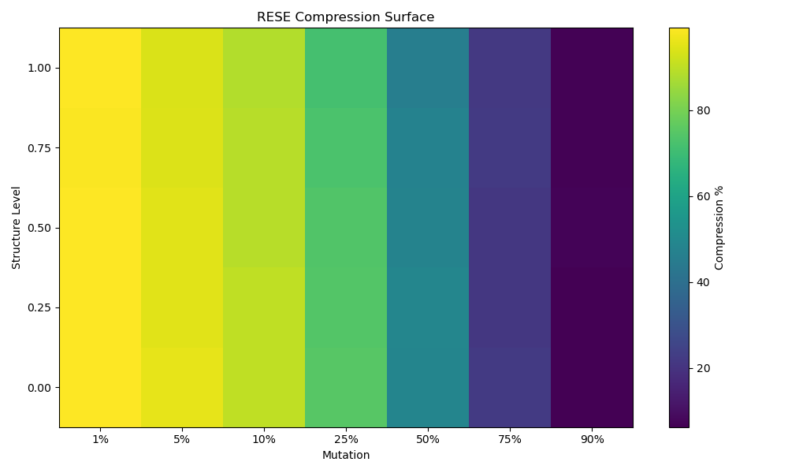

# HLX Delta

Reduce structured data transmission by 90–99% without losing information.

Part of Evo Engineering LLC  
https://www.evo.engineering/

---

## ⚡ Core Result

- Exact reconstruction (SHA256 verified)
- 10x–100x data reduction depending on change density
- Deterministic behavior (no approximation, no training)
- Predictable performance based on structure and mutation

---

## 🔥 Example Output

```

🔥 RESE DELTA ENGINE — LIVE DEMO

Dataset: AEP_hourly.json
Records: 121273

⚡ Deterministic State Compression (Lossless)

━━━━━━━━━━━━━━━━━━━━━━━━━━━━━━

Original Size:     7.31 MB
Delta Size:        551.16 KB
Reduction:         92.64%
Data Reduction Factor: 13.59x

Encode Time:       0.043 sec
Decode Time:       0.150 sec

━━━━━━━━━━━━━━━━━━━━━━━━━━━━━━

Reconstruction:    PASS ✅
SHA256 Match:      VERIFIED

━━━━━━━━━━━━━━━━━━━━━━━━━━━━━━

Efficiency Model Prediction:
Predicted:         90.41%
Actual:            92.64%
Error:             +2.23%

━━━━━━━━━━━━━━━━━━━━━━━━━━━━━━

```

---

## 📊 Compression Surface



Compression efficiency depends on:

- structure / predictability of the system  
- fraction of state that remains unchanged  

---

## 🧠 How It Works

HLX Delta transmits **change instead of full state**:

```

State A → Delta → Encode → Transmit → Decode → Reconstruct State B

````

Key property:

> Compression scales with predictable structure × retained state

The system never loses correctness — only efficiency when structure collapses.

---

## 🧪 Use Cases

- Telemetry and energy systems  
- Distributed system synchronization  
- Event streaming pipelines  
- IoT data transmission  
- Structured JSON evolution  

---

## ▶️ Run Demo

```bash
python demo_rese.py sample_data/sample.json
````

---

## 🔗 Related Systems

* [https://github.com/evo-engineering-llc/apex-twist](https://github.com/evo-engineering-llc/apex-twist) — Compute reduction via field evaluation
* [https://github.com/evo-engineering-llc/hlx-photo](https://github.com/evo-engineering-llc/hlx-photo) — Deterministic reconstruction systems

---

## ⚠️ Notes

* This repo contains a demonstration layer only
* Core engine and optimization layers are not included
* Behavior is deterministic and reproducible

---

## By

Evo Engineering LLC
